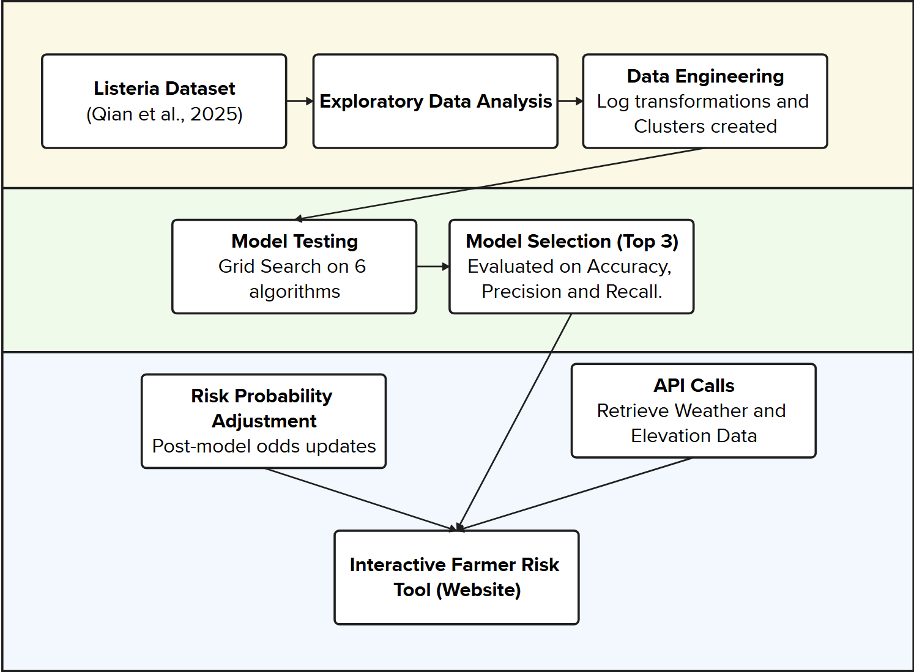

# Project Name: Decision Support Tool for Farmers to Identify Listeria spp. Risk
Project For: IAFP Student Competition

## Authors:
- YeonJin Jung (yj354@cornell.edu)
- Leonie Kemmerling (lk483@cornell.edu)
- Linda Kalunga (lk549@cornell.edu)
- Amelia Nelson (aln65@cornell.edu)

# Last Edit Date:
02/27/2026

# Goal:
Development of a decision support tool for farmers to identify Listeria risk in soil

## Problem Description:
Soil serves as an environmental reservoir for Listeria spp., including pathogenic strains such as Listeria monocytogenes, which can contaminate fresh produce via preharvest routes, such as irrigation runoff, animal intrusion, and rain splash ​(2, 3)​. Produce growers have been facing the need to implement proactive risk management, particularly under frameworks such as the Food Safety Modernization Act (FSMA). However, current soil testing strategies are
    1. largely reactive rather than predictive,
    2. resource intensive, and
    3.  lack standard guidance ​(1, 4)​. 

While growers often collect data on soil properties (e.g., pH, nutrients, organic matter, these data are not routinely leveraged to assess microbial risk. Therefore, a data-driven approach that integrates these data to predict Listeria presence would allow for (i) risk-based soil sampling, (ii) development of targeted interventions, and (iii) efficient allocation of resources for testing. 

## Objectives:
The objectives of this project are to
    1. develop predictive models for Listeria presence in soil,
    2. identify environmental drivers of Listeria risk,
    3. evaluate model robustness and generalizability, and
    4. develop a grower-friendly decision-support tool. 


## Workflow Diagram and Features


### Training
- Listeria data was analyzed using an Exploratory Data Analysis (listeria_eda.ipynb)
- 6 models were tested to evaluate predictive ability to identify Listeria spp. presense (Run_Models_and_Analyze.ipynb OR run_models_basic.py)
- The top 3 models were selected and optimized by hyperparameters and data engineering. Data engineering was done through feature selection, log transformations, and more (listeria_eda.ipynb and Run_Models_and_Analyze.ipynb). 
- Feature Selection was done through literature reviews, expert insight, and permuntation and feature importance looked at through model results and PCA transformations (listeria_eda.ipynb and Run_Models_and_Analyze.ipynb).
### Deployment
- Risk catagories were developed through literature review and expert opinion.
- Decision support tools were then deployed in the form of a website.
- API calls were attatched to the website so that the farmer could input their field location to get specific results.


## Installation Instructions:

### Python version: 3.10 to 3.13
### Node.js required 
### Requred dependencies are listed in requirements.txt, and differ for the website application vs the model preparation and analysis
### RAM requirements: suggusted to have at least 16 GB of RAM available for running models

``` bash
https://github.com/AmeliaNelson1123/pathogen_prediction.git
cd pathogen_prediction
```

Optional 
``` bash
pip install -r requirements.txt
```

### To Run Website Interface
Try python 3.10, 3.11, or 3.13 if the website is not loading or the requirements did not download correctly.


In your terminal, from project root:
``` bash
py -m venv .venv
.\.venv\Scripts\python.exe -m pip install -r website/backend/requirements.txt
.\.venv\Scripts\python.exe -m uvicorn website.backend.main:app --host 127.0.0.1 --port 8000

``` 


Click the http link in your terminal to open the webapp, or just type in http://127.0.0.1:8000 to your browser.

### Uploading and Entering Data and Running the Predictive Model / Risk Score
To run the predictive model please do 1 of the following:
- To run a soil-only model: 
    1) Upload a CSV in the "Soil CSV Upload (optional)" Section
    2) In the "Model Mode (with or without soil/coordinates)" Section, click the dropdown and select "Soil Information Only". 
    3) In "Model Type", select any of the options ("Gradient Boosted Model (Recommended and Best)", "Neural Network", or "SVM (Support Vector Machine)")
- To run a model from longitude and latitude data only (weather and elevation data retrieved from an API automatically)
    1) Enter a date of interest (any time after 2010, and up to 14 days in the future) in the Month/Day/Year format (i.e. 02/14/2026). Please note the current day's data and future data will be retrieved through a forcasting model, and could be innacurate and affect model results.
    2) Select a point on the map or manually enter a coordinate using the "Choosing Coordinates" section.
        - To enter a point manually, press the "Manual Entry" button and input your longitude and latitude.
        - To select a point on the map, press the "Map Pick" button and drag/zoom in as needed to select your location on a map. The selected coordinates will be displayed below the map.
    3) In the "Model Mode (with or without soil/coordinates)" Section, click the dropdown and select "Latitude and Longitude Information Only". 
    4) In "Model Type", select any of the options ("Gradient Boosted Model (Recommended and Best)", "Neural Network", or "SVM (Support Vector Machine)")
- To run a model with both soil data and longitude/latitude data, please follow the instructions of the previous two sections (add soil *and* longitude/latitude data)

For more information on the soil data requirements, please select the help button, and/or dowload the CSVs provided. 

For information on how to go from an excel file to a CSV file, please go to this website: https://support.microsoft.com/en-us/office/save-a-workbook-to-text-format-txt-or-csv-3e9a9d6c-70da-4255-aa28-fcacf1f081e6

and in the specified area, please select the "CSV (comma delimited)" option.


### To Run Exploratory Data Analysis:
Open preparation\listeria_eda.ipynb, and run all cells with a python 3.10 python interpreter.

### To Run Models used in the website:

### To Run our Modeling Testing Process:
Open preparation\Run_Models_and_Analyze.ipynb, and run all cells with a python 3.10 python interpreter.

## Repository Structure:
/data -> Raw and processed data
/website -> website interface
/website/backend/main.py -> the api calls, models, and risk adjustments
/website/backend/models/ -> where the models are saved
/website/frontend/farm-app/src/ -> how the model looks and interacts with the backend
/website/frontend/farm-app/public/ -> the soil example files and any pngs displayed in the website
/preparation -> exploratory data analysis and model selection files


## Reproducibility Statement:
Random Seed, test size, model results, and context was documented throughout our process. This allows for reproducibility to be as great as possible across machines and time.

We recognize that API calls, package deployments (as listed in the requirements), and more will change over time, but we hope to diminish the amount of change as much as possble by keeping our work as reproducible as possible.

## Design Decisions:
We chose to keep our preliminary work on evaluating the data (listeria_eda.ipynb) and the model selection (Run_Models_and_Analyze.ipynb) within our repository to show context to our decisions and show our process for the IAFP Student Competition Hackathon. The process saves the models selected with the file saving_selected_models_for_pipeline.py.

## Citations, Thanks, and Recognitions
Data was provided by:
* Liao, J., Guo, X., Weller, D.L. et al. Nationwide genomic atlas of soil-dwelling Listeria reveals effects of selection and population ecology on pangenome evolution. Nat Microbiol 6, 1021–1030 (2021). https://doi.org/10.1038/s41564-021-00935-7

Influence from Models Chosen was developed from (and public repository created by):
* Chenhao Qian, Huan Yang, Jayadev Acharya, Jingqiu Liao, Renata Ivanek, Martin Wiedmann,
Initializing a Public Repository for Hosting Benchmark Datasets to Facilitate Machine Learning Model Development in Food Safety, Journal of Food Protection, Volume 88, Issue 3, 2025, 100463, ISSN 0362-028X, https://doi.org/10.1016/j.jfp.2025.100463.

API Calls were made to or External Data Downloads were made to:
* Livneh daily CONUS near-surface gridded meteorological and derived hydrometeorological data (1915-2011). https://psl.noaa.gov/data/gridded/data.livneh.html
* For geospatial, land coverage data, to be the most comparable to ARC-GIS, we decided to work with the National Land Cover Database by USGS as hosted by the Google Earch Engine. https://www.usgs.gov/node/279743.


Inspiration for development was prompted by IAFP Student Competition Hackathon 2026.


## License
This project is licensed under the terms of the Apache 2.0 license.
